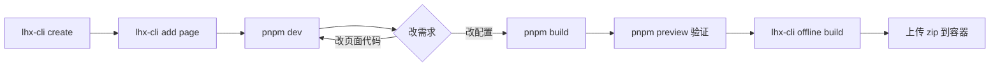

# 🚀 快速开始

> 本章面向**第一次接触 lhx-kit** 的开发者。五分钟让你跑起来一个 MPA 页面；深一点的架构与决策请读 [🧠 架构总览](./architecture)。

## 先决条件

| 依赖 | 版本 | 说明 |
| --- | --- | --- |
| Node.js | `>= 18.18.0` | ESM / `fetch` / `ReadableStream` 已稳定；`jiti` 依赖现代 `createRequire` 语义 |
| pnpm | `>= 9` | monorepo 使用 `workspace:*` 协议；`pnpm-workspace.yaml` 声明 `apps/*` / `packages/*` / `examples/*` |
| Git | `>= 2.30` | 可选。CLI 的 `--git` 选项会调用，不装也不影响其他功能 |

:::tip 版本检查一键命令
```bash
node --version && pnpm --version
```
:::

:::warning Node 16 / npm 的情况
:::details 为什么不支持 Node 16 / 仅使用 npm？
1. `jiti@2` 要求 `createRequire` 的 CJS interop 语义，这是 Node 18.18 才完整稳定的
2. `pnpm-workspace.yaml` 的 `workspace:*` 协议 npm 不识别（需要 npm workspaces 语法改写）
3. 项目默认开启 corepack，npm 用户需要手动设置 `packageManager` 字段

真的要在 npm 下使用：锁 `packageManager: "npm@10.x"`，删除 `pnpm-workspace.yaml`，把每个 `workspace:*` 改为文件系统路径或发 npm。**不推荐。**
:::
:::

## 安装 monorepo

```bash title="Terminal"
git clone git@github.com:juwenzhang/lhx-kit.git
cd lhx-kit
pnpm install                          # 安装全部 workspace 依赖
pnpm --filter '@lhx-kit/*' build      # 一次性构建所有内部包
```

:::info 为什么要一次性 build packages？
examples（`vmpa` / `rmpa`）通过 `workspace:*` 引用 `@lhx-kit/config` 等包。**pnpm 只建软链，不帮你 build**。`@lhx-kit/config` 的 `main` 指向 `dist/index.js`，如果没 build，examples 启动时会抛：

```text
Cannot find module '.../packages/config/dist/index.js'
```

所以 clone 下来第一件事永远是 `pnpm --filter '@lhx-kit/*' build`。后续改包源码时用 `pnpm --filter '@lhx-kit/<包名>' dev`（tsup watch 模式）即可。
:::

## 用脚手架创建新项目

### 交互式（推荐首次使用）

```bash
pnpm exec lhx-cli create my-app
```

CLI 会问你下面这些问题：

```text
? 选择模板  · react-mpa
? 启用哪些 feature? (空格选择)
   ◯ 离线打包 (offline)
   ◯ CDN 外挂 (cdn)
   ◉ Mock (MSW)
   ◉ E2E (Playwright)
? 包管理器 · pnpm
? 是否初始化 git 仓库? · Yes
? 是否自动安装依赖? · Yes
```

### 非交互式（适合 CI）

```bash title="用在 GitHub Actions / 自动化脚本"
pnpm exec lhx-cli create my-app \
  --template=react-mpa \
  --features=offline,e2e,mock \
  --pm=pnpm \
  --yes
```

### 🔬 `create` 背后做了什么？

:::details 展开查看完整创建流程
```text
1. prompts 收集交互答案（或 --yes 走默认）
2. fs-extra.copy 复制 packages/cli/templates/<template>/files/ → <目标目录>
3. 对每个勾选的 feature，拷贝 templates/<template>/features/<feature>/ → <目标目录>
4. 遍历所有 *.template 文件：
   - 正则替换 <%= projectName %> / {{ projectName }} 等占位
   - 去掉 .template 后缀后写入最终路径
5. ts-morph 打开生成后的 project.config.ts：
   - 找到 defineProjectConfig({...}) 的 ObjectLiteralExpression
   - 为每个勾选的 feature 调用 addPropertyAssignment 插入对应字段
   - 保留原有格式 / 注释 / tab 风格
6. 若 --git，执行 execa('git', ['init']) + 首次 commit
7. 若 --install，执行 execa(pm, ['install'])
8. 打印后续操作（pnpm dev / add page 等）
```

:::tip 为什么不用 giget / degit？
早期版本尝试过通过 `giget` 从 GitHub 拉模板，但：

- **CI 网络不可控**：内网环境 GitHub 访问不稳
- **版本漂移**：modern tarball 机制里模板版本和 CLI 版本可能错配
- **离线可用**：npm 发包时把 `templates/` 一起打进去，`npx lhx-cli` 下来就能用

所以最终决定**把模板放进 CLI 包内部**（`packages/cli/templates/`），走本地 `fs-extra.copy`。
:::
:::

## 在 monorepo 里跑 examples

```bash
# Vue3 MPA 演示
pnpm --filter vmpa dev       # http://localhost:4173
pnpm --filter vmpa build
pnpm --filter vmpa preview

# React MPA 演示
pnpm --filter rmpa dev       # http://localhost:4174
pnpm --filter rmpa build
pnpm --filter rmpa preview
```

两个示例共享同一套 `@lhx-kit/vite-plugin` / `@lhx-kit/runtime` / `@lhx-kit/renderer`；差异仅在：

```ts title="project.config.ts 关键字段差异"
// vmpa
{ framework: 'vue3', ... }

// rmpa
{ framework: 'react', ... }
```

其他所有构建行为（per-page chunk / CDN loader / offline 打包）完全一致。

## 增量添加页面

```bash
cd my-app
pnpm exec lhx-cli add page profile
```

这一条命令一次性生成：

```text title="src/pages/profile/"
src/pages/profile/
├── entry.tsx            # React 模板 → .tsx；Vue 模板 → .ts
├── router.tsx           # HashRouter + 两个 lazy route
├── render.json          # 渲染器就近约定（可选使用）
└── views/
    ├── ProfileLanding.tsx
    └── ProfileAbout.tsx
```

同时 **AST 级** 更新 `project.config.ts`：

```ts title="project.config.ts" {5}
// 修改前
export default defineProjectConfig({
  pages: {
    home: {title: 'Home'},
    settings: {title: 'Settings'}
  }
});

// 修改后（ts-morph 插入第 5 行）
export default defineProjectConfig({
  pages: {
    home: {title: 'Home'},
    settings: {title: 'Settings'},
    profile: {title: 'profile'}
  }
});
```

:::tip AST 修改 vs 字符串拼接
早期我们用字符串正则在 `pages: {` 后面插一行——**踩了三个坑**：

1. 用户加了注释，正则位置错位
2. 用户改成多行格式，缩进对不上
3. 用户用 `pages:{...}` 无空格写法，regex 直接 miss

换成 `ts-morph` 之后，**它把 TS 源码 parse 成 AST**，在 PropertyAssignment 层面插值：

```typescript title="add page 背后的代码"
const source = project.addSourceFileAtPath(configPath);
const defineCall = source.getFirstDescendantByKindOrThrow(SyntaxKind.CallExpression);
const configObj = defineCall.getArguments()[0] as ObjectLiteralExpression;
const pagesAssign = configObj.getProperty('pages') as PropertyAssignment;
const pagesObj = pagesAssign.getInitializerIfKindOrThrow(SyntaxKind.ObjectLiteralExpression);
pagesObj.addPropertyAssignment({
  name: pageName,
  initializer: `{title: '${pageName}'}`
});
source.saveSync();
```

**零踩坑**，保留用户所有原有格式 / 注释 / 行尾风格。
:::

## 📂 创建后的项目结构

```text title="my-app/" {6-10}
my-app/
├── project.config.ts             # SSOT：一份配置贯穿整条链路
├── offline.config.ts             # 仅 --features=offline 时生成
├── vite.config.ts                # 用户只需 plugins:[lhxKit()]
├── template.html                 # MPA 共用模板
├── src/
│   ├── bootstrap.ts              # runtime setupMobile / setupMock 入口
│   ├── pages/                    # 约定：每个子目录一个 page
│   │   └── home/
│   │       ├── entry.tsx
│   │       ├── router.tsx
│   │       ├── render.json
│   │       └── views/
│   ├── components/
│   ├── services/
│   └── mocks/
├── package.json
├── tsconfig.json
├── eslint.config.js              # flat config
├── commitlint.config.cjs         # Conventional Commits
├── lint-staged.config.cjs
├── vitest.config.ts              # 单测
├── playwright.config.ts          # E2E
└── Dockerfile                    # 多阶段构建 + nginx
```

## 🏗️ 典型开发工作流



:::info Mermaid 在 Rspress 默认启用
如果图没渲染，检查 `rspress.config.ts` 里是否设置了 `builderConfig.plugins` 或升级到 `rspress@1.x` 以上。本站已包含。
:::

## 🔗 下一步

推荐按顺序阅读：

1. [🧠 架构总览](./architecture) — 看 6 个包如何协作
2. [⚡ 性能优化](./performance) — chunk 策略演进 + 不拆 react-dom 的论证
3. [🌐 CDN 外挂](./cdn) — 把 React/Vue 请出 bundle 的完整踩坑记录
4. [📱 移动端适配](./mobile-adaptation) — 百度网盘式 rem + 桌面居中方案
5. [⚙️ CLI 参考](../cli/reference) — 全部命令与选项
